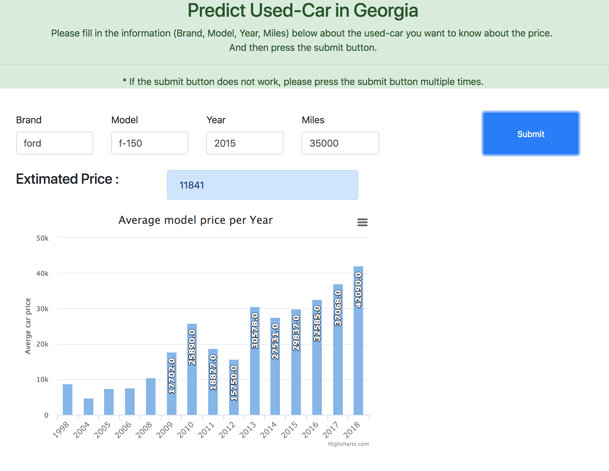

# Predict Used Car Price in Georgia (Sevice WebSite: http://dannyki.ga/)

## Subject : Machine learning based used car prices forecasting web service
#### Period   : 2018. 03 - 2018. 04
#### Tech      : Python (Pandas, Scikit-learn), Data Crawl , AWS, Flask, MySQL, Bootstrap   
#### Model    : XGBooster  (Accuracy : 85%)
#### Structure : 

#### Website : http://dannyki.ga/

#### After fill in the information and then press the submit button.
#### You can check the price of the used car you want, and you can also check the average price for different years with the same model

